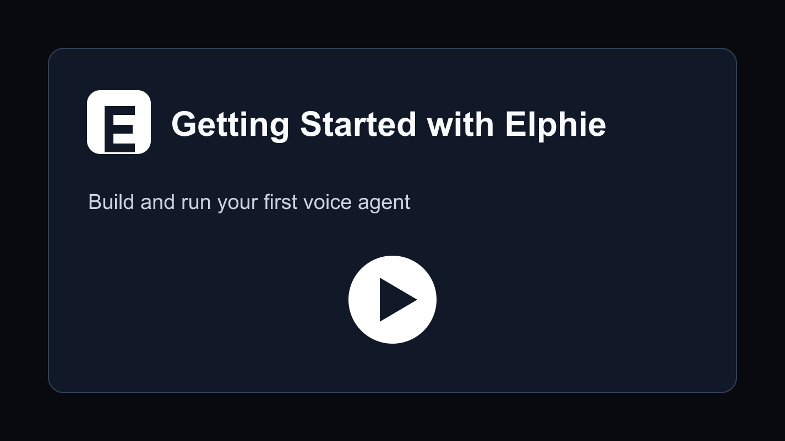

# Elphie AI

> 💡 **Notice**: This documentation is community-maintained. If you spot any translation inaccuracies or content that has drifted from the English version, please feel free to reach out on Slack!
>
> 💡 **注記**: このドキュメントはコミュニティによって保守されています。翻訳の不正確さや英語版からの内容のずれを見つけた場合は、Slack でお知らせください。

**セルフホスト可能な Vapi / Retell の代替手段** -- ビジュアルワークフロービルダーで本番向け音声エージェントを構築し、数分でテストし、MCP 経由で AI コーディングアシスタントに設計や編集を任せられます。

<p align="center">
  <a href="https://elphie.willowave.in">
    
  </a>
  &nbsp;
  <a href="#-クイックスタート">
    
  </a>
  &nbsp;
  <a href="https://join.slack.com/t/elphie-community/shared_invite/zt-3zjb5vwvl-j7hRz3_F1SOn5cH~jm5f5g">
    
  </a>
</p>

<p align="center">
  <a href="https://elphie.willowave.in">📖 ドキュメント</a> &nbsp;·&nbsp;
  <a href="LICENSE">📜 BSD 2-Clause</a> &nbsp;·&nbsp;
  <a href="README.md">🌐 English</a> &nbsp;·&nbsp;
  <a href="README.zh-CN.md">🌐 中文</a>
</p>

<p align="center">
  
</p>

- **セルフホスト可能** -- Vapi や Retell と違い、ベンダーロックインはありません
- **完全な制御と透明性** -- LLM / TTS / STT の統合も柔軟に差し替え・カスタマイズできます
- **YC 卒業生と事業売却を経験した創業者が保守**し、音声 AI を誰もが使えるものに保つことに取り組んでいます

## 🎥 メディア掲載

<div align="center">
  <a href="https://www.youtube.com/watch?v=xD9JEvfCH9k">
    
  </a>
  <br>
  <em><strong>Better Stack</strong> による実践レビュー -- Elphie を詳しく紹介</em>
</div>

<details>
<summary>📺 2 分のプロダクト紹介動画を見たい場合はこちら。</summary>

<div align="center">
  <a href="https://youtu.be/9gPneyf9M9w">
    
  </a>
</div>

</details>

## ⚖️ Elphie vs Vapi vs Retell

音声 AI プラットフォームを評価しているチームに向けて、重要な観点を率直に比較します。

|  | **Elphie** | **Vapi** | **Retell** |
|---|---|---|---|
| **ライセンス** | BSD 2-Clause | プロプライエタリ | プロプライエタリ |
| **セルフホスト** | ✅ 可能 -- Docker コマンド 1 つ | ❌ SaaS のみ | ❌ SaaS のみ |
| **料金** | 無料(セルフホスト)・従量課金(クラウド) | 分単位課金の SaaS | 分単位課金の SaaS |
| **独自 LLM / STT / TTS の利用** | ✅ 任意のプロバイダー、または Elphie 標準スタック | 提供範囲内で設定可能 | 提供範囲内で設定可能 |
| **ソースコードレベルのカスタマイズ** | ✅ 必要に応じてプラットフォームをカスタマイズ可能 | ❌ クローズドソース | ❌ クローズドソース |
| **データレジデンシー** | 自社インフラ、自社ルール | ベンダーのクラウド | ベンダーのクラウド |
| **ベンダーロックイン** | なし | あり | あり |


## 🚀 クイックスタート

##### ローカルマシンに Elphie をダウンロードしてセットアップ

> **注記**
> 製品改善のため、匿名の利用状況データを収集します。無効にするには、起動スクリプトを実行する前に `ENABLE_TELEMETRY=false` を設定してください。

> **注記**
> リモートサーバーでプラットフォームを実行したい場合は、[ドキュメント](https://elphie.willowave.in/deployment/docker#option-2:-remote-server-deployment)を参照してください。

ローカルのチェックアウトまたは配布物から起動します(リポジトリルートに `docker-compose.yaml` があること):

```bash
# macOS / Linux
./scripts/start_docker.sh
```

```powershell
# Windows
.\scripts\start_docker.ps1
```

詳細は [Docker デプロイガイド](https://elphie.willowave.in/deployment/docker) を参照してください。

> **注記**
> 初回起動では、すべてのイメージをダウンロードするため 2-3 分かかる場合があります。起動後、http://localhost:3010 を開くと最初の AI 音声アシスタントを作成できます。
> よくある問題と解決策は 🔧 **[トラブルシューティング](docs/getting-started/troubleshooting.mdx)** を参照してください。

### 🎙️ 最初の音声ボット

1. ブラウザで [http://localhost:3010](http://localhost:3010) を開きます。
2. **Inbound(着信)** または **Outbound(発信)** を選び、ボットに名前を付けます(例: _リード判定_)。続けて用途を 5-10 語で説明します(例: _保険フォーム送信者の購入意向を確認_)。
3. **Test Agent** をクリックします。
4. **Test Audio** でブラウザからエージェントと会話するか、**Test Chat** でテキストベースに素早く反復します。Test Chat ではユーザー発話を編集または再実行でき、Elphie がその地点からエージェントの応答とノード遷移を再生成します。

> 🔑 **API キーは不要です。** Elphie には自動生成されるキーと、組み込みの LLM / TTS / STT スタックが付属しています。必要に応じて、独自の LLM、TTS、STT、または Twilio、Vonage、Telnyx などの電話連携プロバイダーをいつでも接続できます。

## MCP でエージェントを構築

Elphie には MCP サーバーが付属しているため、コーディングエージェントが Elphie ワークスペース内で直接作業できます。

Codex、Claude Code、Cursor、または任意の MCP クライアントを接続すると、既存エージェントの確認、Elphie ドキュメントの検索、ノードスキーマの取得、新しいワークフローの作成、自然言語からのドラフト編集保存ができます。

コーディングエージェントに音声エージェントの構築を依頼するときは、1 行のプロンプトだけでなく、ユースケース用の短いスクリプトを共有してください。エージェントのペルソナ、通話フロー、ルール、反論処理、成功基準、可能であればサンプル会話を含めると効果的です。

アシスタントの接続方法は [MCP ガイド](https://elphie.willowave.in/integrations/mcp) を参照してください。

## 機能

### 音声エージェントビルダー

- Start ノード、Agent ノード、グローバル指示、ツール、遷移、通話終了結果を備えたビジュアルワークフロービルダー
- ブラウザ音声テスト用の **Test Audio** と、高速なプロンプト反復用の **Test Chat** を備えた Test Agent パネル
- 本番ワークフロー向けの QA ノード、ナレッジベース、Webhook、埋め込み、ツール呼び出し

### 音声と電話連携

- Twilio、Vonage、Telnyx、Plivo、Vobiz、Cloudonix、Asterisk ARI などの電話連携を標準搭載
- 対応する電話連携プロバイダーでは通話転送による有人対応が可能
- 独自の LLM、TTS、STT、電話連携プロバイダーを接続可能。成果物は同梱の MinIO または AWS / S3 互換ストレージに保存できます

### 開発者体験

- セルフホスト向けの 1 コマンド Docker セットアップ
- カスタマイズしやすい Python バックエンドとモジュラーなプロバイダー構成
- プログラムからのエージェント作成とアウトバウンド通話に対応する Python / Node SDK

## デプロイ方法

### ローカル開発

[ローカルセットアップ](https://elphie.willowave.in/contribution/setup)を参照してください。

### セルフホストデプロイ

リモートサーバーへのデプロイや HTTPS 設定を含む詳しい手順は、[Docker デプロイガイド](https://elphie.willowave.in/deployment/docker#option-2-remote-server-deployment)を参照してください。

### クラウド版

マネージドクラウド版は [https://www.elphie.com](https://www.elphie.com/) から利用できます。

## 📚 ドキュメント

完全なドキュメントは [https://elphie.willowave.in](https://elphie.willowave.in/) を参照してください。

## 📦 SDKs

- **Python SDK** -- [pypi.org/project/elphie-sdk](https://pypi.org/project/elphie-sdk/)
- **Node SDK** -- [npmjs.com/package/@elphie/sdk](https://www.npmjs.com/package/@elphie/sdk)

## 🤝 コミュニティとサポート

> 👋 **Better Stack の動画から来ましたか?** [Slack コミュニティ](https://join.slack.com/t/elphie-community/shared_invite/zt-3zjb5vwvl-j7hRz3_F1SOn5cH~jm5f5g) にユースケースを投稿してください。すべての返信を確認し、創業チームが初期ユーザーを直接オンボーディングします。

- **Slack** -- Elphie AI のコラボレーションの中心です。メンテナーとつながり、実装前に機能を相談し、セットアップの支援を受け、コントリビューション活動の最新情報を追えます。
- **ドキュメント** -- ガイドとリファレンスは [elphie.willowave.in](https://elphie.willowave.in) にあります。

👉 参加はこちら → [Elphie Community Slack](https://join.slack.com/t/elphie-community/shared_invite/zt-3zjb5vwvl-j7hRz3_F1SOn5cH~jm5f5g)

## 🙌 コントリビューション

コントリビューションを歓迎します。[Slack コミュニティ](https://join.slack.com/t/elphie-community/shared_invite/zt-3zjb5vwvl-j7hRz3_F1SOn5cH~jm5f5g) でアイデアを相談し、[コントリビューター向けセットアップ](https://elphie.willowave.in/contribution/setup) でローカル環境を用意してください。

### はじめに

- リポジトリのローカルコピーを用意する
- 機能ブランチを作成する(`git checkout -b feature/AmazingFeature`)
- 変更をコミットする(`git commit -m 'Add some AmazingFeature'`)
- Slack 経由でメンテナーに変更を共有し、レビューを依頼する

## 📄 ライセンス

Elphie AI は [BSD 2-Clause License](LICENSE) のもとで公開されています。Elphie AI の構築に使われたプロジェクトと同じライセンスであり、互換性と、利用・変更・配布の自由を確保しています。

## 🏢 私たちについて

**Elphie** が ❤️ を込めて開発しています。
創業チームは YC 卒業生と事業売却を経験した創業者で構成され、音声 AI をオープンで誰もが利用できるものに保つことに取り組んでいます。

<br><br><br>

  <p align="center">
    <a href="https://elphie.willowave.in">☁️ クラウド版を試す</a> |
    <a href="https://join.slack.com/t/elphie-community/shared_invite/zt-3zjb5vwvl-j7hRz3_F1SOn5cH~jm5f5g">💬 Slack に参加</a>
  </p>
